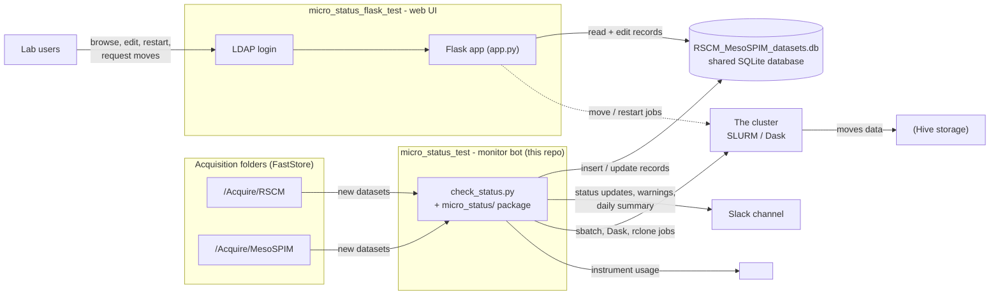

# micro_status_test — RSCM / MesoSPIM monitor bot

Automated monitoring service ("slack bot") for **RSCM** and **MesoSPIM** microscopy datasets.
It runs continuously: it watches the acquisition folders, tracks the state of
every dataset in a shared SQLite database, posts status updates and storage warnings to
Slack, submits cluster work (SLURM / Dask), moves finished datasets from `<FS_ROOT>`
(FastStore) to `<HIVE_ROOT>` (Hive), and reports instrument usage to the online scheduler.

This repo is one half of a two-part system. The other half is the web interface
[`micro_status_flask_test`](../micro_status_flask_test/), which edits the same database —
see [Related project](#related-project-micro_status_flask_test).

> **Paths and hosts in this document** are deployment-specific placeholders:
> `<FS_ROOT>` = FastStore data root · `<HIVE_ROOT>` = Hive data root ·
> `<LOGIN_NODE>` = lab login node · `<SCHEDULER_HOST>` = online scheduler host ·
> `<USER>` = lab account name.
> Actual values live in `micro_status/settings.py` on the server.

## How the two projects fit together



The **shared SQLite database is the contract between the two projects**:

- the bot inserts new datasets and keeps imaging/processing statuses, progress counters
  and flags up to date;
- the web app lets authenticated lab members browse and edit the same records;
- edits made in the web app (e.g. the `paused` flag, `keep_composites`, or a requested
  move) are picked up by the bot on its next scan.

## The monitoring loop

`check_status.py` runs `scan()` in an infinite loop, sleeping 30 seconds between scans.
Each scan performs:

| Step | What it does |
|---|---|
| `check_storage()` | Disk-space checks on Hive and FastStore; posts low-space warnings to Slack (thresholds in `settings.py`) |
| `cleanup_faststore_trash()` | Enforces trash retention (3 days); emergency-purges trash when FastStore hits the critical threshold |
| `move_stale_faststore_datasets()` | Submits move jobs for DB records older than 30 days still under `<FS_ROOT>/Acquire` |
| `check_RSCM_imaging()` | Discovers new RSCM datasets, tracks ribbon imaging progress, posts Slack updates, posts usage to the scheduler |
| `check_mesoSPIM_imaging()` | Same for MesoSPIM (btf + zarr datasets) |
| `check_RSCM_processing()` / `check_mesoSPIM_processing()` | Track the stitching → composites → denoising → IMS pipeline and submit cluster work |
| `check_moving()` | Verifies completed FastStore → Hive moves |
| `db_backup()` | Backs up the SQLite database (one backup per day) |
| `summary_message()` | Posts the "Daily Dataset Status" summary to Slack (imaging / processing in progress, datasets needing attention) |

Notification types: imaging started / paused (crashed?) / finished, processing started /
paused / finished, plus low-space warnings on Hive and FastStore.

## Repository layout

| Path | Purpose |
|---|---|
| `check_status.py` | Entry point — the scanning loop that ties everything together |
| `micro_status/dataset.py` | Shared `Dataset` base class: status tracking, DB updates, Slack messages |
| `micro_status/rscm_dataset.py` | RSCM-specific logic (`vs_series.dat` metadata, ribbons, stitch queue) |
| `micro_status/mesospim_dataset.py` | MesoSPIM-specific logic (btf + zarr datasets, tiles, `instrument_id`) |
| `micro_status/warning.py` | Storage-space warning records and Slack alerts |
| `micro_status/scheduler_report.py` | Posts instrument usage to the online scheduler (`<SCHEDULER_HOST>`, timeLogs-style payloads); failure emails |
| `micro_status/utils.py` | Helpers: move-time policy, zarr metadata backup, etc. |
| `micro_status/validate_tiles.py` | Standalone helper: stitch tiles into TIFFs + PNG previews |
| `micro_status/settings.py` | Operational defaults and deployment config |
| `micro_status/local_settings.py` | Machine-specific private overrides (not committed) |
| `create_db.py` | Creates the SQLite database (contains commented one-time `ALTER TABLE` migrations) |
| `populate_db.py` | Legacy one-off RSCM seeding script (uses its own old DB path) |
| `cleanup_db.py` | Removes demo datasets / prints the dataset count |
| `run_cbpy.sh` | Submits the CBPy denoising job if it is not already in the SLURM queue |
| `run_rscm_cluster.sh` | Ensures Dask scheduler/workers and the RSCM stitch listener are running |
| `requirements.txt` | Pinned Python dependencies |
| `.env` | Slack + scheduler credentials (not committed) |

## Database

- Location: `<FS_ROOT>/RSCM_MesoSPIM_datasets.db` (`DB_LOCATION` in
  `micro_status/settings.py`)
- Backups: created nightly in `<FS_ROOT>/db_backups`
- Bot logs: `<FS_ROOT>/bot_logs/<hostname>_<datetime>.txt`
- Scheduler transmit logs: `<FS_ROOT>/scheduler_transmit_logs`

Tables:

**`dataset`** — one row per acquisition:

- `id`, `name`, `cl_number` (FK → `clnumber`), `pi` (FK → `pi`)
- `imaging_status`: `in_progress` / `paused` / `finished`
- `processing_status`: `not_started` / `started` / `stitched` / `moved_to_hive` /
  `denoised` / `built_ims` / `finished`
- `path_on_fast_store`, `path_on_hive`, `imaris_file_path`, `channels`
- `imaging_no_progress_time`, `processing_no_progress_time` — stall detection
- MesoSPIM progress: `z_layers_total/current/checked`, `ribbons_total/finished`,
  `tiles_total/finished`, `tiles_x/y`, `resolution_xy/z`
- `modality` (`rscm` / `mesospim`), `is_brain`, `imaging_summary`, `processing_summary`, `created`
- Flags editable in the web UI: `paused`, `moving`, `moved`, `keep_composites`,
  `delete_405`, `public`, `peace_json_created`
- Scheduler columns: `instrument_id`, `imaging_start`, `imaging_end`, `scheduler_posted`,
  `scheduler_record_id`, `scheduler_notified`

**`pi`** — `id`, `name`, `public_folder_name`

**`clnumber`** — `id`, `name` (unique), `pi` (FK → `pi`)

**`warning`** — `id`, `type` (`space_hive_thr0`, `space_hive_thr1`, `low_space_hive`,
`space_faststore_thr0`, `space_faststore_thr1`, `low_space_faststore`), `active`,
`message_sent`

> The schema is embedded in the code and many columns are accessed by positional index —
> be careful with schema changes. `create_db.py` contains commented one-time `ALTER TABLE`
> blocks that follow the migration convention.

## Setup (new instance)

```bash
ssh <USER>@<LOGIN_NODE>
conda activate microstatus
cd micro_status_test
python3 -m pip install -r requirements.txt
```

1. Clone the repo.
2. Copy the `.env` file from a running instance into the repo root — it holds the Slack
   and scheduler credentials (key names only, values are secrets):

   | Key | Used for |
   |---|---|
   | `SLACK_CHANNEL` | Slack channel for status updates and warnings |
   | `SLACK_TOKEN` | Slack bot token |
   | `SCHEDULER_USER`, `SCHEDULER_PASS` | Usage posting to the online scheduler (`<SCHEDULER_HOST>`) |
   | `SCHEDULER_EMAIL_SENDER`, `SCHEDULER_EMAIL_PASSWORD`, `SCHEDULER_EMAIL_RECIPIENTS` | Failure-alert emails |

3. Optionally add machine-specific overrides in `micro_status/local_settings.py`
   (not committed).
4. Create a fresh database with `python3 create_db.py`, or point `DB_LOCATION` at an
   existing one.
5. Run the bot (below).

Dependency notes: `requirements.txt` pins the Slack/XML packages and
`imaris-ims-file-reader`; `tifffile` is also needed at runtime but not pinned;
`validate_tiles.py` additionally needs `numpy` and `scikit-image`.

## Running

```bash
ssh <USER>@<LOGIN_NODE>
conda activate microstatus
cd micro_status_test
python3 check_status.py
```

The process loops forever (one scan every 30 seconds). Stop it with `Ctrl-C`.
Logs are written to `<FS_ROOT>/bot_logs/`.

## Operational warnings

- `MESSAGES_ENABLED = True` — Slack posts are **real**.
- `SCHEDULER_POSTING_ENABLED = True` — usage posts to `<SCHEDULER_HOST>` are **real**.
- Moves run `rclone copy` + `rclone check`, then move the source dataset to
  `<FS_ROOT>/trash/autodelete` (3-day retention, then deleted; emergency purge on
  critical low space).
- Cluster commands (`sbatch`, `squeue`, `scancel`) are issued directly.
- Do not run `check_status.py` as a smoke test — it touches production-like paths. Use
  `python3 -m compileall check_status.py create_db.py populate_db.py cleanup_db.py micro_status`
  for a syntax check instead (see `AGENTS.md`).

## Related project: micro_status_flask_test

[`micro_status_flask_test`](../micro_status_flask_test/) is the web front end for the
**same database**. It provides LDAP-authenticated browsing of the Dataset table (filtered
by PI and time), record editing, dataset creation, processing restarts, and move requests
to `<HIVE_ROOT>`. Deletion is not allowed. It runs on the same login node
(`<LOGIN_NODE>:1414`).

Because both tools read and write the same SQLite file, corrections made in the web UI
(statuses, flags like `paused` or `keep_composites`) are picked up by the bot on its next
scan — see the diagram at the top.
